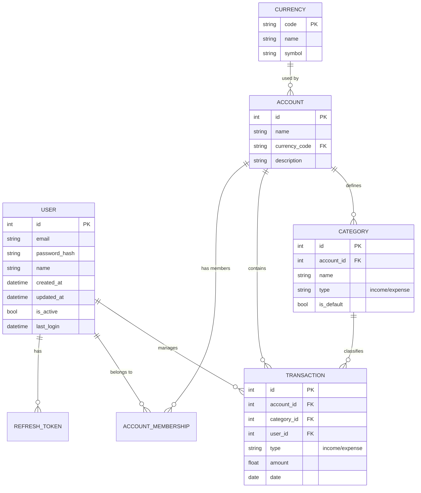

# Contributing

## Project Structure

Relevant top level directories are the following:

```
├── app/
├── migrations/
├── src/
└── tests/
```

* `app`: Contains the actual API implementation
* `migrations`: Alembic migrations for database changes
* `bin`: Directory containing random scripts that might be useful during development
* `test`: This one is self explanatory :D Pytests go in here

Inside the `app` directory the project is organised in a similar way as MVC would be, but in this case the concepts are a bit different:

```
app/
├── config.py
├── crud/
├── database.py
├── main.py
├── models.py
├── routes/
├── schemas/
└── utils/
```

Directories:

* `crud`: Inside this directory reside the files and functions that do operations on the data layer.
* `routes`: The API "shape" is defined through routers and routes. This allows isolation of API resources where each resource is configured by its own router.
* `schemas`: Pydantic schemas allow for data validation on API requests and responses.
* `utils`: Groups of functions that are useful for the whole project, examples are: messages, exceptions, time calculation operations, etc etc.

Files:

* `config.py`: File that reads environment variables and init
* `database.py`: Inits database and creates connections to the request sessions.
* `main.py`: API startup file
* `models.py`: Database Table Schemas are defined in this file. At this moment there's no strong reason to break this file into a directory.

## Data Model

Here's a quick description of the relationships between the entities:

* A person is represented by **User**. Each **User** can create multiple **Account**. An **Account** is a "collection" of **Transaction**. **User** can create multiple **Transaction** that have a **Category** and belong to a single **Account**. **User** have multiple **AccountMembership** for multiple **Account** but only one per **Account**. When a **User** creates an **Account**, an **AccountMembership** is also created with `is_owner` property.

The intent of this diagram is to provide a visual aid to the entity relationships:



## Handling exceptions

To have uniform error handling, errors should be handled by raising a `[PexaException](https://github.com/TiagoMauricio/pexa/blob/main/app/utils/exceptions.py#L1)`. Use one of the classes that have super type of `PexaException` to throw errors.

```python
import app.utils.exceptions as err

(...)

if (not from_date and to_date) or (from_date and not to_date):
        raise err.BadRequestException(message=messages.REQUIRED_DATE_RANGE)
```

In case the error you're trying to throw doesn't have a class that fits its description, create one of your own and add a handler (refer to [Issue #16](https://github.com/TiagoMauricio/pexa/issues/16#issuecomment-3706479729)).

Exception example:

```python
# app/utils/exceptions.py
(...)

class NewException(PexaException):
  """Description"""
  pass
```

Handler example:
```python
# app/main.py
(...)

@app.exception_handler(err.NewException)
async def bad_request_handler(
    request: Request, exc: err.NewException
) -> JSONResponse:
    return JSONResponse(status_code=400, content={"message": exc.message})
```

Furthermore to help with consistency, leverage `app/utils/messages.py` to create strings to be reused when throwing your new exception.
